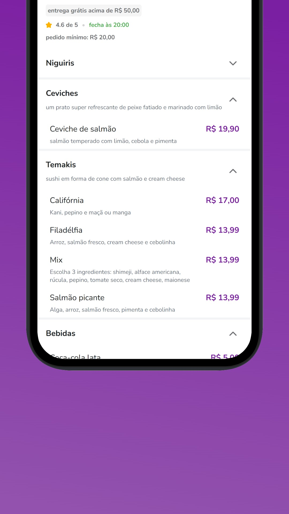
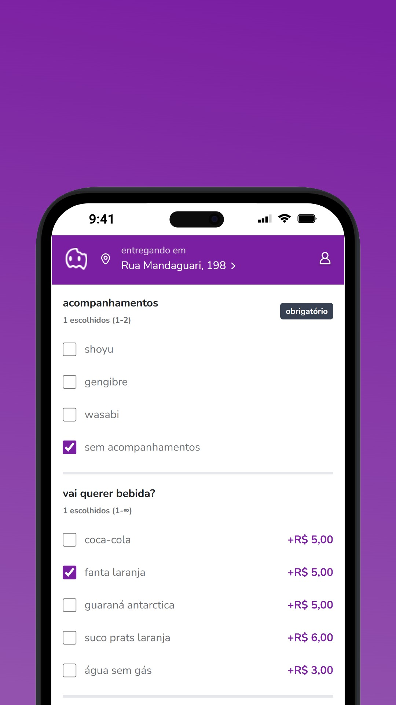
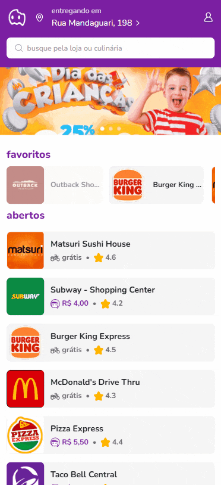
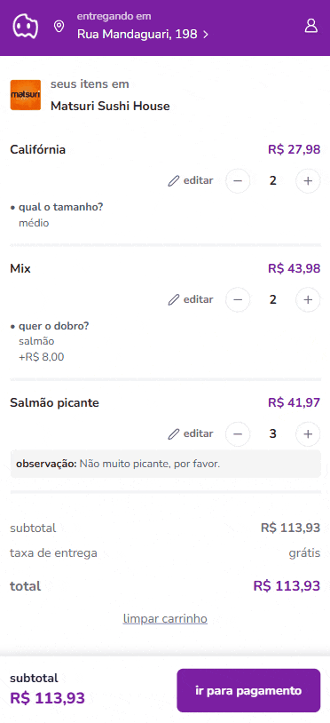

<h1 align="center">
  
</h1>

  
  

Mobile First challenge with Next.

  
  
  
  

See a preview.

  
  

## 🔺 Demo

### [Live Demo, click here](https://aiqfome-jhonatanbergmanns-projects.vercel.app/)

## 🎨 UI

### [Figma, click here](https://www.figma.com/design/oYEQWm7AlBX4iEFbPv3Yib/-aiqfome--teste-front-end---MOBILE--Copy-?node-id=0-1&p=f&t=WlOZN6uHMOeTqcxt-0)

## 📦 Tech Stack

- Next
- Typescript
- Tailwind CSS
- Lucide React

[check others in package.json](package.json)

## 🔩 Installation

To install and run the project locally, follow these steps:

1. Install [**Yarn**](https://yarnpkg.com/) on your computer
1. Clone the repository `git clone https://github.com/jhonbergmann/aiqfome.git`
1. Navigate to the project directory: `cd aiqfome`
1. Install the dependencies: `yarn install`

## ⚙️ Usage

1. Start the development server: `yarn dev`
1. Now access the following url in your browser: `http://localhost:3000`
